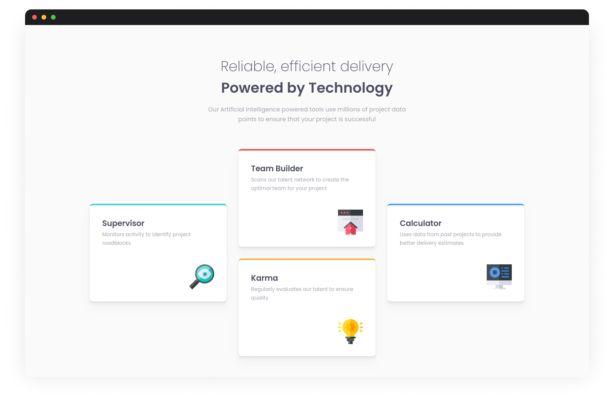
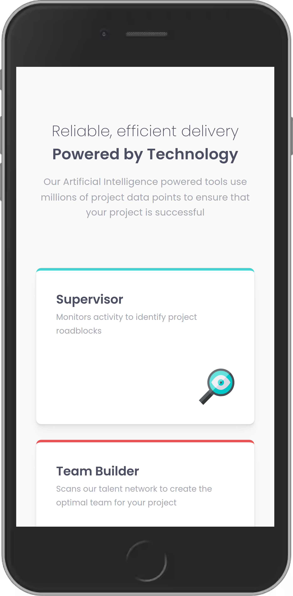
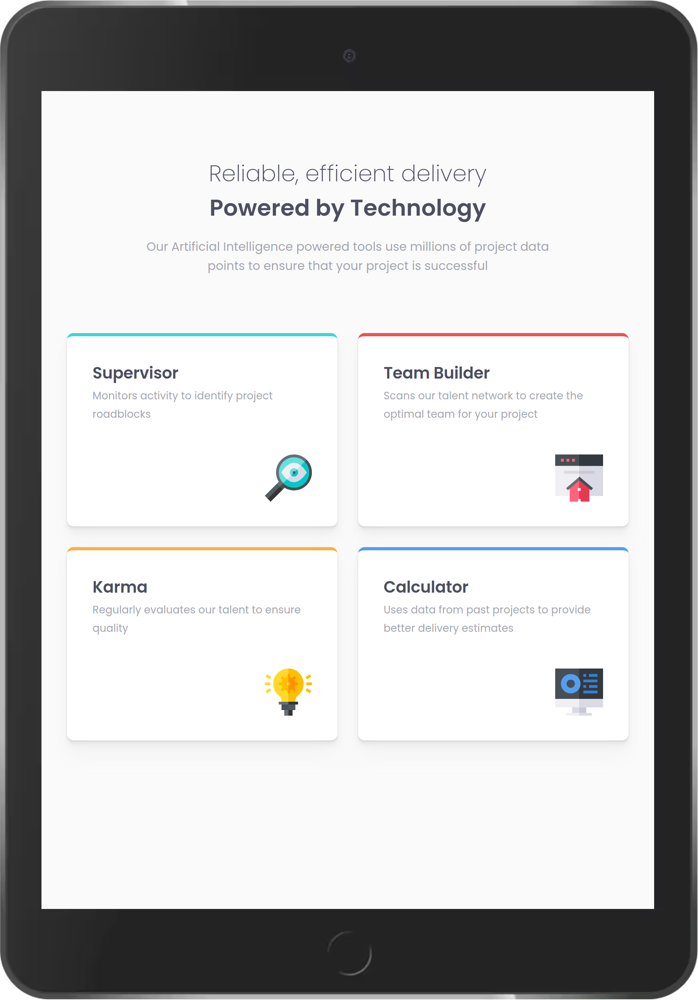

# Frontend Mentor - Four card feature section solution

This is a solution to the [Four card feature section challenge on Frontend Mentor](https://www.frontendmentor.io/challenges/four-card-feature-section-weK1eFYK). Frontend Mentor challenges help you improve your coding skills by building realistic projects.

## Table of contents

- [Overview](#overview)
  - [The challenge](#the-challenge)
  - [Screenshots](#screenshots)
  - [Links](#links)
- [My process](#my-process)
  - [Built with](#built-with)
  - [Useful resources](#useful-resources)
- [Author](#author)

## Overview

### The challenge

Users should be able to:

- [x] View the optimal layout for the site depending on their device's screen size

### Screenshots

**Desktop**

**Mobile**

**Bonus: Tablet**

### Links

- Solution URL: https://www.frontendmentor.io/solutions/four-card-feature-section-built-with-11ty-and-webc-YCIbpaHqir
- Live Site URL: https://four-card-feature-section-11ty-webc.netlify.app/

## My process

### Built with

11ty using WebC for the template language

### Useful resources

- [Time to move on from Nunjucks? | BryceWray.com](https://www.brycewray.com/posts/2023/03/time-move-on-nunjucks/) - This is what got me to try WebC.
- [All the ways to render a WebC component with 11ty - David Luhr](https://luhr.co/blog/2023/07/11/all-the-ways-to-render-a-webc-component-with-11ty/)
- [My notes on Eleventy WebC components: Levi McGranahan](https://levimcg.com/blog/my-notes-on-eleventy-webc-components/)

## Author

- Website - [Josh Javier](https://joshjavier.com/)
- Frontend Mentor - [@joshjavier](https://www.frontendmentor.io/profile/joshjavier)
